# Canny Edge Detector
## Authors: Kevin Lee (kl3642), Kevin Zheng (kz1252)


Implementation of the Canny Edge Detector for CS-GY 6643 Computer Vision


You can **install the required dependencies** using the provided `conda` environment or `requirements.txt`:

	$ conda env create --file environment.yaml --name canny

	OR

	$ pip install -r requirements.txt


Note that the `conda` environment was created in `Windows`.


**To run**:

	$ python main.py --image <filename>

Example:

	$ python main.py --image Barbara.bmp

Note that the input image files are stored in the `testimages/` directory.

<div style="page-break-after: always;"></div>

# Results

## `Barbara.bmp`

Original Image:


<div style="page-break-after: always;"></div>

Gaussian-Smoothed:


<div style="page-break-after: always;"></div>

Magnitude:

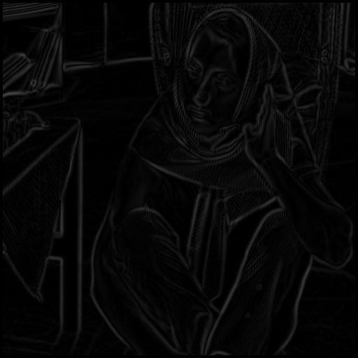

<div style="page-break-after: always;"></div>

Suppressed:

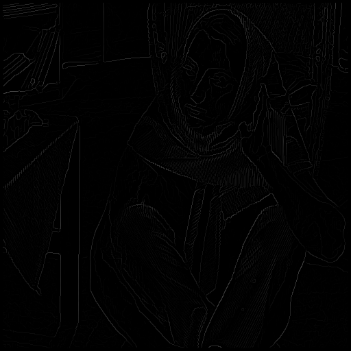

<div style="page-break-after: always;"></div>

Histogram:

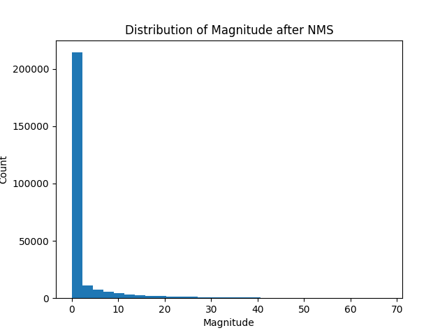

<div style="page-break-after: always;"></div>

Threshold25 (`t = 2.846`):

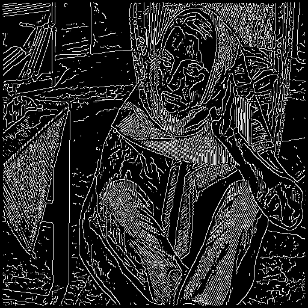

<div style="page-break-after: always;"></div>

Threshold50 (`t = 6.438`):


<div style="page-break-after: always;"></div>

Threshold75 (`t = 14.014`):

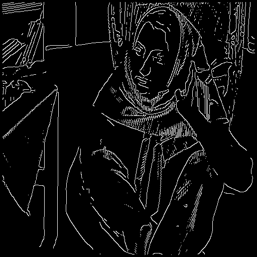

<div style="page-break-after: always;"></div>

## `Goldhill.bmp`

Original Image:


<div style="page-break-after: always;"></div>

Gaussian-Smoothed:

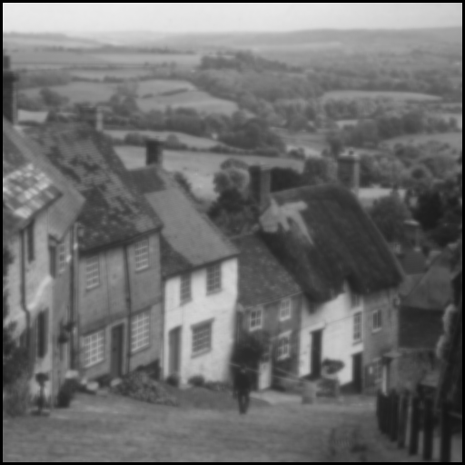

<div style="page-break-after: always;"></div>

Magnitude:

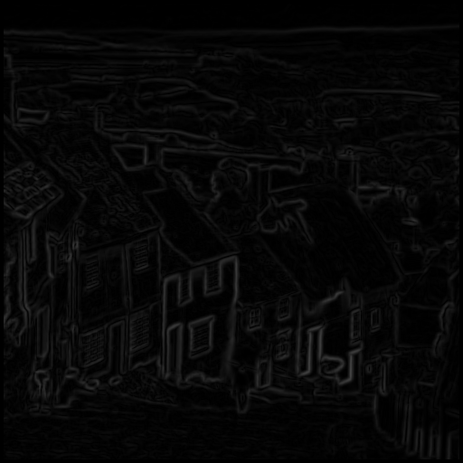

<div style="page-break-after: always;"></div>

Suppressed:


<div style="page-break-after: always;"></div>

Histogram:


<div style="page-break-after: always;"></div>

Threshold25 (`t = 3.549`):


<div style="page-break-after: always;"></div>

Threshold50 (`t = 7.068`):


<div style="page-break-after: always;"></div>

Threshold75 (`t = 13.898`):

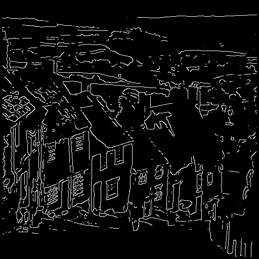

<div style="page-break-after: always;"></div>


## `Peppers.bmp`

Original Image:


<div style="page-break-after: always;"></div>

Gaussian-Smoothed:

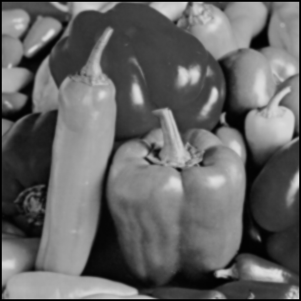

<div style="page-break-after: always;"></div>

Magnitude:

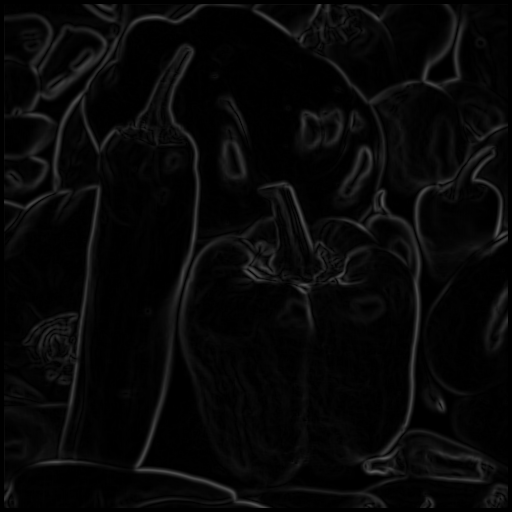

<div style="page-break-after: always;"></div>

Suppressed:

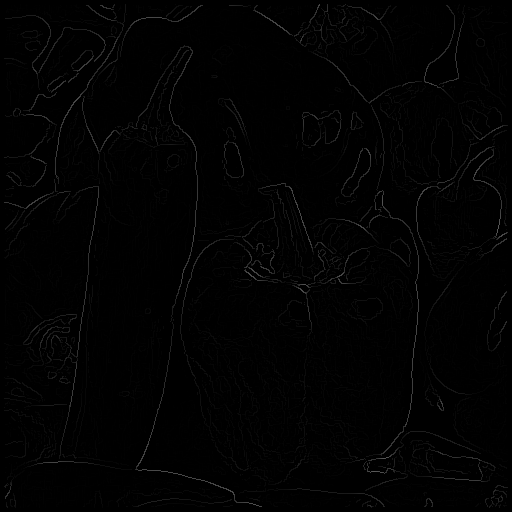

<div style="page-break-after: always;"></div>

Histogram:


<div style="page-break-after: always;"></div>

Threshold25 (`t = 1.654`):

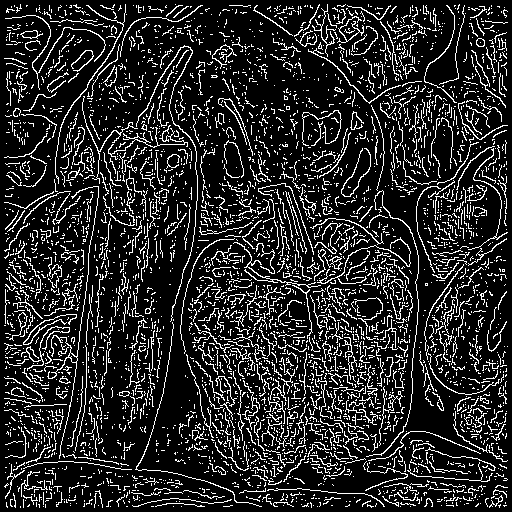

<div style="page-break-after: always;"></div>

Threshold50 (`t = 3.434`):


<div style="page-break-after: always;"></div>

Threshold75 (`t = 9.657`):

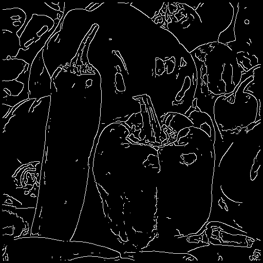

<div style="page-break-after: always;"></div>

# Source Code

`canny.py`
```
import numpy as np

# 7x7 Gaussian mask
GAUSSIAN = np.array([
    [1, 1, 2, 2, 2, 1, 1],
    [1, 2, 2, 4, 2, 2, 1],
    [2, 2, 4, 8, 4, 2, 2],
    [2, 4, 8, 16, 8, 4, 2],
    [2, 2, 4, 8, 4, 2, 2],
    [1, 2, 2, 4, 2, 2, 1],
    [1, 1, 2, 2, 2, 1, 1]
])

# 3x3 masks
ZERO_DEGREES = np.array([
    [-1, 0, 1],
    [-2, 0, 2],
    [-1, 0, 1]
])

FORTY_FIVE_DEGREES = np.array([
    [0, 1, 2],
    [-1, 0, 1],
    [-2, -1, 0]
])

NINETY_DEGREES = np.array([
    [1, 2, 1],
    [0, 0, 0],
    [-1, -2, -1]
])

ONE_HUNDRED_THIRTY_FIVE_DEGREES = np.array([
    [2, 1, 0],
    [1, 0, -1],
    [0, -1, -2]
])

# Functions
def convolve(mat, filtermask):
    """
    Performs convolutions given an input and kernel
    Args:
        mat (numpy.ndarray): input array 
        filtermask (numpy.ndarray): kernel
    Returns:
        numpy.ndarray: result of convolutions
    """

    # get number of rows and cols in matrix
    rows, cols = mat.shape[0], mat.shape[1]

    # calculate the range of the mask
    radius, length = int(filtermask.shape[0] / 2), filtermask.shape[0]

    # initialize result
    res = np.empty(mat.shape)
    res[:] = np.nan

    # perform convolutions
    for i in range(rows - length + 1):
        for j in range(cols - length + 1):
            res[i+radius,j+radius] = np.sum(filtermask * mat[i:i+length, j:j+length])

    return res
 
def gaussian_smoothing(image):
    """
    Smooths an input image using gaussian smoothing
    Args:
        image (numpy.ndarray): Image to be processed.
    Returns:
        numpy.ndarray: result of gaussian smoothing
    """

    # smooth image by convolving it with pre-defined mask
    smoothed = convolve(image, GAUSSIAN)
    
    # normalize result
    smoothed /= 140

    return smoothed
                

def gradient_operation(image):
    """
    Computes gradient magnitude and angles given input image
    Args:
        image (numpy.ndarray): Image to be processed.
    Returns:
        numpy.ndarray: gradient magnitudes
        numpy.ndarray: gradient angles
    """

    #compute gradients
    mat1, mat2, mat3, mat4 = convolve(image, ZERO_DEGREES), convolve(image, FORTY_FIVE_DEGREES),convolve(image, NINETY_DEGREES), convolve(image, ONE_HUNDRED_THIRTY_FIVE_DEGREES)

    #fetch size of rows and cols
    rows, cols = mat1.shape[0], mat1.shape[1]

    #initialize result
    magnitudes = np.empty((rows, cols))
    magnitudes[:] = np.nan

    #compute edge magnitudes
    for i in range(rows):
        for j in range(cols):
            magnitudes[i,j]= max([np.abs(mat1[i,j]), np.abs(mat2[i,j]), np.abs(mat3[i,j]), np.abs(mat4[i,j])]) / 4

    #store gradient angles in array to pass on
    gradientdirections = np.array([mat1, mat2, mat3, mat4])

    return magnitudes, gradientdirections

def quantize_angle(gradient_directions, i, j):
    """
    Quantize angle to index of the filter that produces the maximum response.
    Args:
        gradient_directions (numpy.ndarray): Array of gradient directions from 4 different filters.
        i (int): Row index.
        j (int): Column index.
    Returns:
        int: Quantized angle.
    """

    # Get index of mask that produced the maximum absolute response
    quantized = np.argmax([np.abs(gradient_directions[0][i, j]), np.abs(gradient_directions[1][i, j]), 
                           np.abs(gradient_directions[2][i, j]), np.abs(gradient_directions[3][i, j])])

    return quantized

def non_maxima_suppression(gradient_magnitude, gradient_directions):
    """
    Performs non-maximum suppression on gradient magnitudes.
    Args:
        gradient_magnitude (numpy.ndarray): Gradient magnitude.
        gradient_directions (numpy.ndarray): Array of gradient directions from 4 different filters.
    Returns:
        numpy.ndarray: Image after non-maximum suppression.
    """
    # initialize result
    suppressed = np.zeros(gradient_magnitude.shape)


    for i in range(1, gradient_magnitude.shape[0] - 1):
        for j in range(1, gradient_magnitude.shape[1] - 1):

            # If gradient magnitude is undefined, set to 0
            if np.isnan(gradient_magnitude[i, j]):
                suppressed[i, j] = 0
                continue

            neighbors = np.array([0,0])

            # fetch angle
            angle = quantize_angle(gradient_directions, i, j)

            # fetch neighbors based on angle
            if angle == 0:
                neighbors = [gradient_magnitude[i, j - 1], gradient_magnitude[i, j + 1]]
            elif angle == 1:
                neighbors = [gradient_magnitude[i - 1, j + 1], gradient_magnitude[i + 1, j - 1]]
            elif angle == 2:
                neighbors = [gradient_magnitude[i - 1, j], gradient_magnitude[i + 1, j]]
            elif angle == 3:
                neighbors = [gradient_magnitude[i - 1, j - 1], gradient_magnitude[i + 1, j + 1]]
            
            # If neighbors are undefined, set to 0
            if np.isnan(neighbors[0]) or np.isnan(neighbors[1]):
                suppressed[i, j] = 0
                continue
            
            # If gradient magnitude is greater than neighbors, keep it
            if gradient_magnitude[i, j] >= max(neighbors):
                suppressed[i, j] = gradient_magnitude[i, j]
            # otherwise, suppress the value
            else:
                suppressed[i, j] = 0
    
    # create copy of suppressed magnitudes and set zero-values to null
    hold = suppressed.copy()
    hold[hold == 0] = np.nan

    #calculate percentiles
    percentiles = [25, 50, 75]
    supp_percentiles = np.array([])
    for percentile in percentiles:
        supp_percentiles = np.append(supp_percentiles, np.nanpercentile(hold, percentile))
        print(f"{percentile}%: {np.nanpercentile(hold, percentile)}")

    print(f"Mean: {np.mean(suppressed)}")

    # set undefined values to 0
    suppressed[np.isnan(suppressed)] = 0

    return suppressed, supp_percentiles

def simple_threshold(image, thresholds):
    """
    Simple thresholding.
    Args:
        image (numpy.ndarray): Image to be processed.
        thresholds (list): Thresholds.
    Returns:
        numpy.ndarray: Image after simple thresholding.
    """
    
    # initialize results
    twenty_edges = np.zeros(image.shape)
    fifty_edges = np.zeros(image.shape)
    seventy_edges = np.zeros(image.shape)

    # perform thresholding, only allow value through if it is above or equal to that corresponding threshold
    for i in range(image.shape[0]):
        for j in range(image.shape[1]):
            if image[i, j] >= thresholds[0]:
                twenty_edges[i, j] = 255
            if image[i, j] >= thresholds[1]:
                fifty_edges[i, j] = 255
            if image[i, j] >= thresholds[2]:
                seventy_edges[i, j] = 255
    
    return [twenty_edges, fifty_edges, seventy_edges]
```

<div style="page-break-after: always;"></div>

`main.py`
```
from canny import *
import argparse
import matplotlib.pyplot as plt
import numpy as np
from PIL import Image
import os

#parser for image input
parser = argparse.ArgumentParser(description='Canny edge detection.')
parser.add_argument('--image', type=str, default='example.jpg', help='Path to image.')
args = parser.parse_args()

def visualize(image, image_edges, nms_image, directory):
    """
    Visualize image and its edges & histogram of suppressed magnitudes.
    Args:
        image (numpy.ndarray): Image to be processed.
        image_edges (List): List of image edges.
    """
    # original image
    plt.subplot(2, 2, 1)
    plt.imshow(image, cmap='gray')
    plt.title('Original')
    plt.axis('off')

    # 25% threshold
    plt.subplot(2, 2, 2)
    plt.imshow(image_edges[0], cmap='gray')
    plt.title('Edges (25%)')
    plt.axis('off')

    # 50% threshold
    plt.subplot(2, 2, 3)
    plt.imshow(image_edges[1], cmap='gray')
    plt.title('Edges (50%)')
    plt.axis('off')

    # 75% threshold
    plt.subplot(2, 2, 4)
    plt.imshow(image_edges[2], cmap='gray')
    plt.title('Edges (75%)')
    plt.axis('off')

    plt.savefig(directory + "/comparison.png")
    plt.clf()

    # flatten suppressed image
    suppressed = np.ravel(nms_image)

    # plot histogram of suppressed magnitudes
    plt.hist(suppressed, bins = 30)
    plt.title("Distribution of Magnitude after NMS")
    plt.xlabel("Magnitude")
    plt.ylabel("Count")

    plt.savefig(directory + "/histogram.png")
    plt.clf()

def main():

    #fetch filename from command line arguments
    filename = args.image

    #read image from testimages directory
    image = np.array(Image.open("testimages/" + filename).convert('L'))

    # Show image dimensions
    print(f"Image dimensions: {image.shape}")

    #create new directory in output for storing results
    newpath = 'output/' + filename[:-4] 
    if not os.path.exists(newpath):
        os.makedirs(newpath)

    # Peform gaussian smoothing
    image_smooth = gaussian_smoothing(image)
    guassian_smooth = Image.fromarray((image_smooth).astype(np.uint8))
    guassian_smooth.save(newpath + "/guassian_smooth.bmp")

    # Compute gradient magnitudes and directions
    gradient_magnitude, gradient_directions = gradient_operation(image_smooth)
    magnitude = Image.fromarray((gradient_magnitude).astype(np.uint8))
    magnitude.save(newpath + "/magnitude.bmp")

    # Perform non-maxima suppression
    image_suppressed, thresholds = non_maxima_suppression(gradient_magnitude, gradient_directions)
    suppressed = Image.fromarray((image_suppressed*255).astype(np.uint8))
    suppressed.save(newpath + "/nmssuppressed.bmp")

    # Show suppressed image dimensions
    print(f"Suppressed image dimensions: {image_suppressed.shape}")

    # Perform simple thresholding
    image_edges = simple_threshold(image_suppressed, thresholds)
    i1, i2, i3 = image_edges[0], image_edges[1], image_edges[2]

    #save images from various levels of thresholding
    image1 = Image.fromarray((i1).astype(np.uint8))
    image1.save(newpath + "/threshold25.bmp")
    image2 = Image.fromarray((i2).astype(np.uint8))
    image2.save(newpath + "/threshold50.bmp")
    image3 = Image.fromarray((i3).astype(np.uint8))
    image3.save(newpath + "/threshold75.bmp")

    visualize(image, image_edges, image_suppressed, newpath)

if __name__ == "__main__":
    main()
```